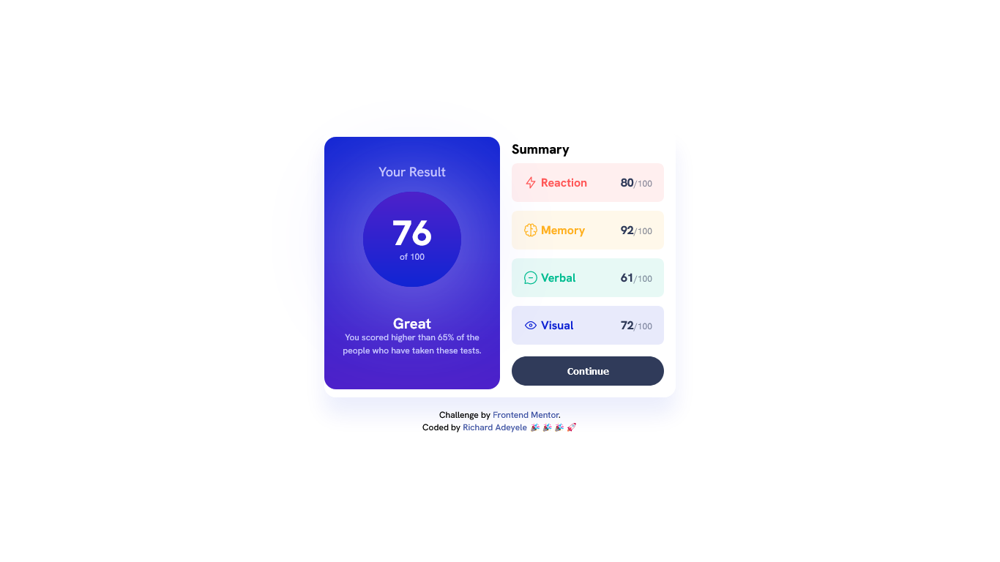

# Frontend Mentor - Result Summary Component

This is a solution to the [Result Summary challenge on Frontend Mentor](https://www.frontendmentor.io/challenges/results-summary-component-CE_K6s0maV/hub). Frontend Mentor challenges help you improve your coding skills by building realistic projects.

## Table of contents

- [Overview](#overview)
  - [Screenshot](#screenshot)
  - [Links](#links)
- [My process](#my-process)
  - [Built with](#built-with)
  - [What I learned](#what-i-learned)
  - [Continued development](#continued-development)
- [Author](#author)

## Overview

### Screenshot



### Links

- Solution URL: [QR Code Challenge](https://github.com/Richlee-demo/Result-summary/blob/main/index.html)
- Live URL: [QR Code Challenge](https://richlee-demo.github.io/Result-summary/)

## My process

### Built with

- HTML
- CSS

### What I learned

During my time designing for the challenge, I acquired valuable insight in creating responsive designs that seamlessly adapt to various devices. This involved gaining an understanding of the trade-offs and decision-making processes required when faced with design challenges. Additionally, I also learned how to create gradients and circles, which are fundamental elements in design. I believe that these skills have equipped me to create visually appealing and functional designs that enhance the user experience, and I am excited to apply them in my future projects.

To see how you can add code snippets, see below:

```html
<h1>Some CSS code I'm proud of</h1>
```

```css
.score {
  display: flex;
  align-items: center;
  flex-direction: column;
  width: 64%;
  border-radius: 50%;
  background-image: linear-gradient(hsla(256, 72%, 46%, 1), hsl(234, 85%, 45%));
  box-shadow: 0 0 9rem hsl(241, 100%, 89%);
  padding-top: 2rem;
  padding-bottom: 2rem;
}
```

```css
@media only screen and (max-width: 37.5rem) {
  body {
    margin-top: 0;
    font-family: "Hanken Grotesk", sans-serif;
    background-color: hsl(0, 0%, 100%);;
    font-size: 1rem;
    display: flex;
    justify-content: flex-start;
    align-items: center;
    flex-direction: column;
    gap: 1rem;
  }
```

```css
.resultContainer,
  button,
  .right > h3 {
    margin-left: 1.5rem;
    margin-right: 1.5rem;
  }
```

### Continued development

In my upcoming projects, one of my key objectives is to enhance my understanding of semantics to improve accessibility and ensure proper definition of my codes. Additionally, I aspire to acquire proficiency in writing comments that are clear and comprehensible to anyone who may view them, regardless of their technical expertise. I believe that these skills will enable me to write high-quality code that is easy to navigate and understand, and ultimately lead to better outcomes in my work.

## Author

- Website - [Richard Adeyele](https://app.uxcel.com/ux/LMA2N5TROOXQ)
- Frontend Mentor - [@Richlee-demo](https://www.frontendmentor.io/profile/Richlee-demo)
- Twitter - [@JCRichLee](https://www.twitter.com/JCRichLee)
